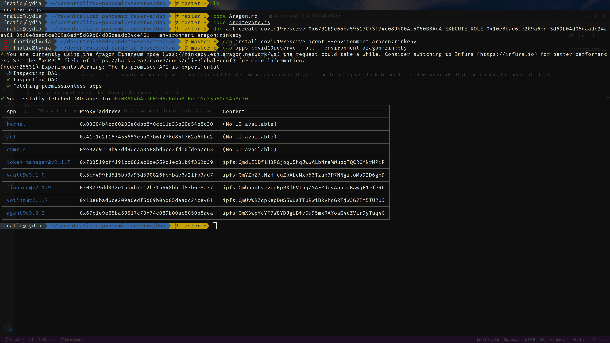

We use aragon toolkit to interact with aragon dao through our frontend.
Hospitals enter their details and needs and then we create a vote in our dao based on those needs.

## CreateVote
`createVote.js` script creates a vote on our dao, which once approved by the memebers on aragon UI will lead to a response back to our UI to show hospitals that their needs has been fulfilled.

### Dev Setup
We setup agent on our dao through @aragon/cli like this:
`dao install covid19reserve agent --environment aragon:rinkeby`

THis will trigger a vote in dao to allow agent's local installation, once we approve that our local installation is ready. Next step is to give execute method to our voting app ona agent.
`dao acl create covid19reserve <YOUR_AGENT_ADDRESS> EXECUTE_ROLE <VOTING_APP_ADDR> <VOTING_APP_ADDR> --environment aragon:rinkeby`

To get these contract addresses go to aragon ui and see them or you can just run
`dao apps covid19reserve --all --environment aragon:rinkeby`

Once you allow access to the voting app to execute actions on agent, you can then create votes directly from the frontend and do operations locally.

## Future Usage of Aragon
Aragon doesn't support a very direct way to interact with it's dao as of now so that's why we had to move through all this permission setup and then toolkit methods. But quoting aragon team, "There is a new Aragon library coming in a couple of weeks that will make these types of interactions very easy to do", intreactions here refer to interacting with apps on dao and smart contracts directly.

So in future we plan to use aragon's new libraries to make this interaction much easier.